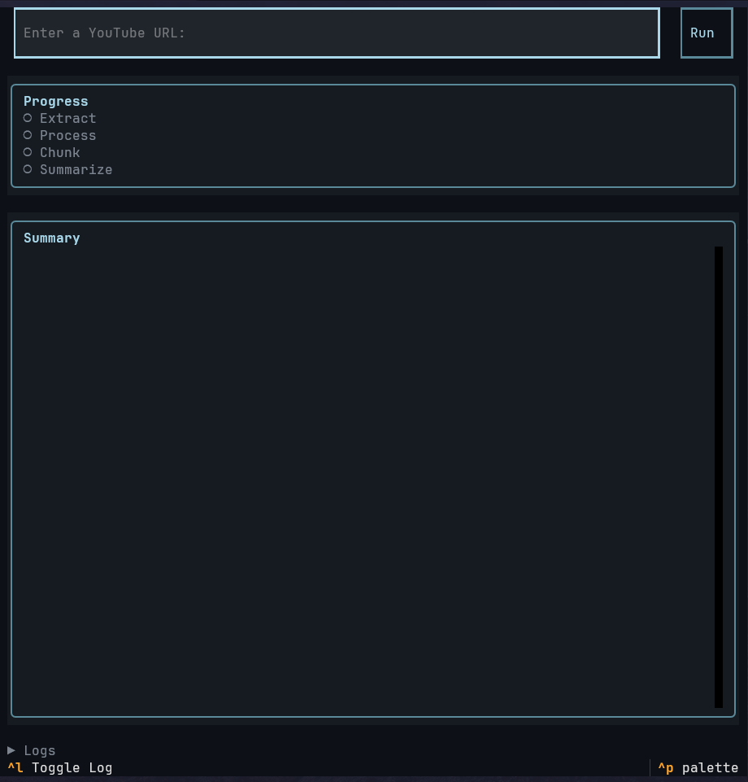

# Subtext

An interactive TUI app for extracting YouTube subtitles and summarizing them with LLMs. Save time extracting insights without listening to hours-long podcasts.



## Features:
- Extraction (Support for multiple languages with priority fallback)
- Regex Processing (Improve token efficiency)
- Chunking
- LLM Summary
- Configurable models (API Key) and prompts
- Keyboard shortcuts

## Install

```bash
git clone https://github.com/justin8ty/subtext.git
pip install uv
uv sync
```

## Setup

Run the app and press `Ctrl+P` → "Settings" to configure your API key.

Config is stored at:
- Windows: `%APPDATA%\subtext\config.toml`
- Unix: `~/.config/subtext/config.toml`

## Usage

```bash
uv run subtext
```

Paste a YouTube URL, hit Enter.
Summaries saved to `./output/` as Markdown.

## Shortcuts

| Key | Action |
|-----|--------|
| `Ctrl+P` | Command palette (settings) |
| `Ctrl+X` | Cancel |
| `Ctrl+Y` | Copy summary |
| `Ctrl+L` | Toggle logs |
| `Ctrl+C` | Quit |

## Tech Stack

Python, Textual, yt-dlp, Gemini/OpenAI SDK
